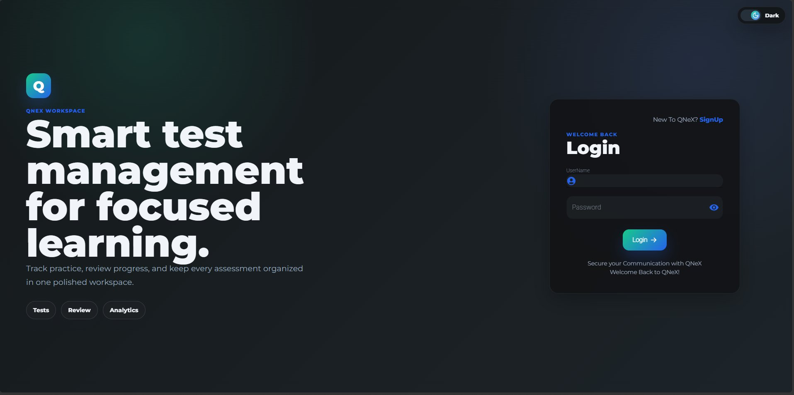
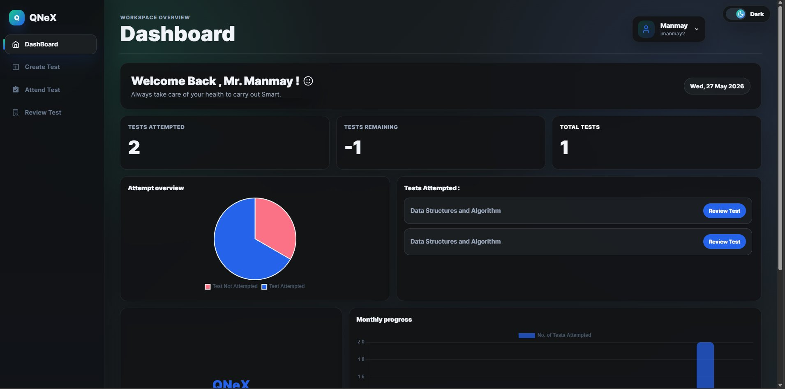

<div align="center">

<!-- ══════════════════════════════════════════════════════════════ -->
<!--                     HERO SECTION                              -->
<!-- ══════════════════════════════════════════════════════════════ -->


<br/>

<!-- LOGO PLACEHOLDER -->


<br/><br/>

# ⚡ QNeX — Intelligent Quiz & Assessment Platform

### *Create. Share. Compete. Analyze. — All in One Place.*

<br/>

<!-- LIVE DEMO BADGE BUTTONS -->
[](https://qnexv1.netlify.app)
[](https://qnexv1.netlify.app)
[](https://qnex.onrender.com)
[](#api-overview)

<br/>

<!-- TECH STACK BADGES -->


<br/>

<!-- STATUS BADGES -->


<br/>

---

> **QNeX** is a full-stack, production-deployed quiz and assessment platform built on the MERN stack — engineered for educators, students, and competitive learners. It delivers a seamless quiz experience with instant analytics, subject-wise performance comparisons, and a dynamic leaderboard — all wrapped in a premium, responsive SaaS-grade interface.

---

</div>

<br/>

## 🔗 Quick Access

<div align="center">

| Resource | Link |
|:---:|:---:|
| 🚀 **Live Application** | [https://qnexv1.netlify.app](https://qnexv1.netlify.app) |
| ⚙️ **Backend API** | [https://qnex.onrender.com](https://qnex.onrender.com) |
| 🌐 **Frontend Deployment** | Netlify — Auto CI/CD from `main` branch |
| 🗄️ **Database** | MongoDB Atlas — Cloud Cluster |
| 🐙 **Repository** | [github.com/imanmay2](https://github.com/imanmay2) |
| 📖 **API Documentation** | [Jump to API Section](#api-overview) |

</div>

<br/>

---

## 📸 Live Preview

<div align="center">

### 🌐 [→ Try QNeX Now: https://qnexv1.netlify.app](https://qnexv1.netlify.app)

> QNeX is **fully deployed** and live in production. No local setup required to experience the platform.

### 🏠 Landing & Login


### 📊 User Dashboard


</div>

<br/>

---

## 📋 Table of Contents

<details>
<summary><b>Click to expand full contents</b></summary>

- [🌟 Why QNeX?](#-why-qnex)
- [🎯 Overview](#-overview)
- [✨ Features](#-features)
- [📸 Screenshots](#-screenshots)
- [🏗️ Architecture](#️-architecture)
- [🛠️ Tech Stack](#️-tech-stack)
- [⚡ Getting Started](#-getting-started)
- [🔧 Environment Variables](#-environment-variables)
- [🔌 API Overview](#api-overview)
- [🚀 Deployment](#-deployment)
- [🔒 Security](#-security)
- [⚡ Performance](#-performance)
- [🔭 Future Scope](#-future-scope)
- [🤝 Contributing](#-contributing)
- [👥 Contributors](#-contributors)
- [📄 License](#-license)

</details>

<br/>

---

## 🌟 Why QNeX?

<div align="center">

> *"Most quiz platforms are either too simple or too complex. QNeX is engineered to be both powerful and intuitive."*

</div>

In a world of generic assessment tools, **QNeX** stands apart:

| 🆚 Other Platforms | ✅ QNeX |
|---|---|
| Limited analytics | **Deep subject-wise comparison analytics** |
| Static result pages | **Interactive performance dashboards** |
| No easy sharing mechanism | **Unique quiz codes for instant sharing** |
| Poor mobile experience | **Fully responsive across all devices** |
| Clunky, outdated UI | **Premium SaaS-grade modern interface** |
| Basic scoring only | **Leaderboard & ranking system** |
| No role distinction | **Admin/Instructor + Student roles** |

<br/>

### 🎯 Built For:
- 🎓 **Educators & Instructors** — Create, manage, and analyze quizzes at scale
- 🧑‍🎓 **Students & Learners** — Take quizzes, track progress, compete on leaderboards
- 🏢 **Institutions** — Conduct assessments with rich analytics
- 💼 **Hackathons & Portfolios** — A technically impressive full-stack MERN showcase

<br/>

---

## 🎯 Overview

**QNeX** (Quiz + Nexus) is a cutting-edge, full-stack quiz and assessment web application designed to bridge the gap between quiz creation and meaningful performance insights. Built on the robust **MERN stack** and deployed on cloud infrastructure, QNeX offers a complete end-to-end quiz lifecycle:

```
Create Quiz → Generate Unique Code → Share with Students
     ↓
Students Attempt Quiz → Submit Answers
     ↓
Instant Results → Analytics Dashboard → Subject-wise Comparison → Leaderboard
```

Whether you're a teacher conducting class assessments, a student preparing for exams, or an organization running competitive tests — **QNeX delivers a premium, real-world assessment experience**.

<br/>

---

## ✨ Features

### 🏆 Core Features

<table>
<tr>
<td width="50%">

#### 📝 Quiz Creation & Management
- ✅ Create MCQ-based quizzes with rich question builder
- ✅ Multi-subject quiz support
- ✅ Configure scoring rules
- ✅ Edit and manage existing quizzes
- ✅ Unique quiz code generation for easy sharing

</td>
<td width="50%">

#### 🎯 Smooth Quiz Experience
- ✅ Clean, distraction-free quiz UI
- ✅ Question navigation panel
- ✅ Answer review before submission
- ✅ Progress indicator
- ✅ Instant result display on submission

</td>
</tr>
<tr>
<td width="50%">

#### 📊 Advanced Analytics
- ✅ **Subject-wise performance comparison**
- ✅ Score breakdown by topic/category
- ✅ Attempt history tracking
- ✅ Correct vs. incorrect answer analysis
- ✅ Performance trend visualization
- ✅ Detailed result reports

</td>
<td width="50%">

#### 🏅 Leaderboard & Gamification
- ✅ **Dynamic leaderboard ranking**
- ✅ Score-based ranking per quiz
- ✅ All-time top performers
- ✅ Quiz-specific rankings
- ✅ Competitive performance metrics
- ✅ Achievement tracking

</td>
</tr>
<tr>
<td width="50%">

#### 🔐 Authentication & Security
- ✅ JWT-based secure authentication
- ✅ Role-based access (Admin / Student)
- ✅ Protected routes and API endpoints
- ✅ Secure token storage strategy
- ✅ Session management
- ✅ Password encryption with bcrypt

</td>
<td width="50%">

#### 📱 Responsive Modern UI
- ✅ Fully responsive — desktop, tablet, mobile
- ✅ Tailwind CSS premium styling
- ✅ Smooth animations and transitions
- ✅ Dark/Light mode support
- ✅ Intuitive navigation
- ✅ SaaS-grade UX design

</td>
</tr>
</table>

<br/>

### 🌟 Premium Differentiators

```
🔗  Unique Quiz Codes     →  Share any quiz in seconds with a unique code
📊  Subject Analytics     →  Compare performance across subjects visually
🏆  Live Leaderboard      →  Ranked competition for every quiz
📱  Mobile-First          →  Optimized experience across all screen sizes
🔒  Secure Auth           →  JWT + bcrypt industry-standard security
👥  Role-Based Access     →  Separate instructor and student experiences
```

<br/>

---

## 📸 Screenshots

<div align="center">

### 🏠 Landing & Login Page


### 📊 User Dashboard


</div>

<br/>

---

## 🏗️ Architecture

### System Architecture

```
┌─────────────────────────────────────────────────────────────────┐
│                         CLIENT LAYER                            │
│              React.js + Vite + Tailwind CSS                     │
│         [Netlify — https://qnexv1.netlify.app]                  │
└────────────────────────┬────────────────────────────────────────┘
                         │ HTTPS / REST API
                         ▼
┌─────────────────────────────────────────────────────────────────┐
│                        SERVER LAYER                             │
│              Node.js + Express.js REST API                      │
│           [Render — https://qnex.onrender.com]                  │
│                                                                 │
│   ┌──────────┐  ┌──────────┐  ┌──────────┐  ┌──────────────┐  │
│   │  Auth    │  │  Quiz    │  │ Results  │  │  Analytics   │  │
│   │  Routes  │  │  Routes  │  │  Routes  │  │    Routes    │  │
│   └──────────┘  └──────────┘  └──────────┘  └──────────────┘  │
│                                                                 │
│   ┌─────────────────────────────────────────────────────────┐  │
│   │         JWT Middleware + Role-Based Guards              │  │
│   └─────────────────────────────────────────────────────────┘  │
└────────────────────────┬────────────────────────────────────────┘
                         │ Mongoose ODM
                         ▼
┌─────────────────────────────────────────────────────────────────┐
│                       DATABASE LAYER                            │
│                    MongoDB Atlas (Cloud)                        │
│                                                                 │
│      Users ──── Quizzes ──── Questions ──── Attempts ──── Results │
└─────────────────────────────────────────────────────────────────┘
```

### Request-Response Flow

```
User Action → React Component → API Service (Axios)
    → Express Router → Middleware (Auth/Validation)
        → Controller → Mongoose Model → MongoDB Atlas
            → Response → State Update → UI Re-render
```

<br/>

---

## 🛠️ Tech Stack

<div align="center">

### Frontend
| Technology | Purpose | Version |
|:---:|:---:|:---:|
| ⚛️ React.js | UI Component Library | ^18.x |
| ⚡ Vite | Build Tool & Dev Server | ^5.x |
| 🎨 Tailwind CSS | Utility-First Styling | ^3.x |
| 🔀 React Router | Client-Side Routing | ^6.x |
| 📡 Axios | HTTP Client | ^1.x |
| 🔑 JWT Decode | Token Parsing | ^3.x |

### Backend
| Technology | Purpose | Version |
|:---:|:---:|:---:|
| 🟢 Node.js | JavaScript Runtime | ^20.x |
| 🚂 Express.js | Web Framework | ^4.x |
| 🍃 MongoDB | NoSQL Database | ^7.x |
| 🔗 Mongoose | ODM for MongoDB | ^8.x |
| 🔐 JWT | Authentication Tokens | ^9.x |
| 🔒 bcryptjs | Password Hashing | ^2.x |
| 🌐 CORS | Cross-Origin Handling | ^2.x |
| 📦 dotenv | Environment Management | ^16.x |

### Infrastructure & DevOps
| Service | Role |
|:---:|:---:|
| 🟢 Netlify | Frontend Hosting + CI/CD |
| 🔵 Render | Backend API Hosting |
| ☁️ MongoDB Atlas | Cloud Database Cluster |
| 🐙 GitHub | Version Control + Source |

</div>

<br/>

---

## ⚡ Getting Started

### Prerequisites

Before you begin, ensure you have the following installed:

```bash
node  --version   # v18.x or higher
npm   --version   # v9.x or higher
git   --version   # any recent version
```

You'll also need:
- A **MongoDB Atlas** account (free tier works)
- A **Render** account (for backend deployment)
- A **Netlify** account (for frontend deployment)

---

### 🚀 Local Installation

#### Step 1 — Clone the Repository

```bash
git clone https://github.com/imanmay2/qnex.git
cd qnex
```

#### Step 2 — Backend Setup

```bash
# Navigate to the backend directory
cd backend

# Install all dependencies
npm install

# Create your environment file
cp .env.example .env
# → Edit .env with your credentials (see Environment Variables section)

# Start the development server
npm run dev
# → API server running at http://localhost:5000
```

#### Step 3 — Frontend Setup

```bash
# Open a new terminal, navigate to the frontend directory
cd frontend

# Install all dependencies
npm install

# Create your environment file
cp .env.example .env
# → Set VITE_API_URL=http://localhost:5000

# Start the Vite dev server
npm run dev
# → App running at http://localhost:5173
```

#### Step 4 — Open in Browser

```
Frontend  →  http://localhost:5173
Backend   →  http://localhost:5000
API Base  →  http://localhost:5000/api
```

---

### 🐳 One-Command Quick Start (with concurrently)

```bash
# From the root directory
npm install
npm run dev   # Starts both frontend and backend concurrently
```

<br/>

---

## 🔧 Environment Variables

### Backend `.env`

```env
# ─── Server ─────────────────────────────────
PORT=5000
NODE_ENV=development

# ─── Database ───────────────────────────────
MONGODB_URI=mongodb+srv://<username>:<password>@cluster0.xxxxx.mongodb.net/qnex?retryWrites=true&w=majority

# ─── Authentication ─────────────────────────
JWT_SECRET=your_super_secure_jwt_secret_key_here
JWT_EXPIRE=7d

# ─── CORS ───────────────────────────────────
CLIENT_URL=http://localhost:5173
```

### Frontend `.env`

```env
# ─── API Configuration ──────────────────────
VITE_API_URL=http://localhost:5000

# ─── App Config ─────────────────────────────
VITE_APP_NAME=QNeX
VITE_APP_VERSION=1.0.0
```

> ⚠️ **Security Note:** Never commit `.env` files to version control. Always use `.env.example` for documentation.

<br/>

---

## 🔌 API Overview

> **Base URL (Production):** `https://qnex.onrender.com/api`
> **Base URL (Development):** `http://localhost:5000/api`

### 🔐 Authentication Endpoints

| Method | Endpoint | Description | Auth |
|:---:|---|---|:---:|
| `POST` | `/auth/register` | Register new user | ❌ |
| `POST` | `/auth/login` | Login & receive JWT | ❌ |
| `GET` | `/auth/me` | Get current user profile | ✅ |
| `POST` | `/auth/logout` | Logout user | ✅ |

### 📝 Quiz Endpoints

| Method | Endpoint | Description | Auth |
|:---:|---|---|:---:|
| `POST` | `/quizzes` | Create new quiz | ✅ Admin |
| `GET` | `/quizzes` | Get all quizzes (instructor's) | ✅ |
| `GET` | `/quizzes/:id` | Get quiz by ID | ✅ |
| `PUT` | `/quizzes/:id` | Update quiz | ✅ Admin |
| `DELETE` | `/quizzes/:id` | Delete quiz | ✅ Admin |

### 🎯 Attempt & Result Endpoints

| Method | Endpoint | Description | Auth |
|:---:|---|---|:---:|
| `POST` | `/attempts` | Submit quiz attempt | ✅ |
| `GET` | `/attempts/my` | Get user's all attempts | ✅ |
| `GET` | `/attempts/:id` | Get specific attempt result | ✅ |
| `GET` | `/results/:quizId` | Get all results for a quiz | ✅ Admin |

### 📊 Analytics Endpoints

| Method | Endpoint | Description | Auth |
|:---:|---|---|:---:|
| `GET` | `/analytics/me` | Personal performance analytics | ✅ |
| `GET` | `/analytics/quiz/:id` | Quiz-wise analytics | ✅ Admin |
| `GET` | `/analytics/subject` | Subject-wise comparison data | ✅ |
| `GET` | `/leaderboard/:quizId` | Quiz leaderboard | ✅ |

<br/>

<details>
<summary><b>📄 Sample API Request/Response</b></summary>

**POST** `/api/auth/login`

```json
// Request
{
  "email": "user@example.com",
  "password": "securepassword123"
}

// Response 200 OK
{
  "success": true,
  "token": "eyJhbGciOiJIUzI1NiIsInR5cCI6IkpXVCJ9...",
  "user": {
    "_id": "64abc123def456",
    "name": "John Doe",
    "email": "user@example.com",
    "role": "student"
  }
}
```

**POST** `/api/attempts` — Submit Quiz

```json
// Request
{
  "quizId": "64abc789xyz",
  "answers": [
    { "questionId": "q1", "selectedOption": 2 },
    { "questionId": "q2", "selectedOption": 0 }
  ]
}

// Response 201 Created
{
  "success": true,
  "result": {
    "score": 8,
    "totalQuestions": 10,
    "percentage": 80,
    "rank": 3,
    "subjectBreakdown": [
      { "subject": "Mathematics", "score": 4, "total": 5 },
      { "subject": "Physics", "score": 4, "total": 5 }
    ]
  }
}
```

</details>

<br/>

---

## 🚀 Deployment

### 🌐 Frontend — Netlify

[](https://app.netlify.com/start)

```bash
# Build Command
npm run build

# Publish Directory
dist

# Environment Variables (set in Netlify dashboard)
VITE_API_URL=https://qnex.onrender.com
```

**Steps:**
1. Push your code to GitHub
2. Connect your GitHub repo on [netlify.com](https://netlify.com)
3. Set build command: `npm run build` and publish dir: `dist`
4. Add environment variables in **Site Settings → Environment Variables**
5. Deploy — auto CI/CD on every push to `main`

> 🔗 **Live:** [https://qnexv1.netlify.app](https://qnexv1.netlify.app)

---

### ⚙️ Backend — Render

```bash
# Start Command
node server.js

# Build Command (optional)
npm install

# Root Directory
backend/
```

**Steps:**
1. Create a new **Web Service** on [render.com](https://render.com)
2. Connect your GitHub repository
3. Set **Root Directory** to `backend`
4. Add environment variables (see `.env` section)
5. Deploy — auto-deploy on push to `main`

> 🔗 **Live API:** [https://qnex.onrender.com](https://qnex.onrender.com)

---

### 🗄️ MongoDB Atlas Setup

```
1. Create account at https://cloud.mongodb.com
2. Create a new Project → Build a Cluster (Free M0 Tier)
3. Database Access → Add Database User (username + password)
4. Network Access → Add IP Address → Allow from Anywhere (0.0.0.0/0)
5. Connect → Drivers → Copy connection string
6. Replace <password> with your DB user password
7. Add to backend .env as MONGODB_URI
```

> ⚡ **Tip:** Use **MongoDB Atlas Search** for future full-text quiz search features.

<br/>

---

## 🔒 Security

QNeX implements industry-standard security practices:

| Security Feature | Implementation |
|---|---|
| 🔐 **Authentication** | JWT tokens with configurable expiry |
| 🔒 **Password Security** | bcryptjs with salt rounds (10+) |
| 🛡️ **Route Protection** | JWT middleware on all private endpoints |
| 👥 **Role-Based Access** | Separate Admin and Student privileges |
| 🌐 **CORS Policy** | Configured whitelist for allowed origins |
| 🚫 **Input Validation** | Server-side request validation |
| 📦 **Env Secrets** | All sensitive data in environment variables |
| 🔑 **Token Storage** | Secure client-side token management |

<br/>

---

## ⚡ Performance

QNeX is optimized for speed and scalability:

- **⚡ Vite Build** — Lightning-fast HMR and optimized production bundles
- **🗜️ Code Splitting** — Lazy-loaded routes for minimal initial load
- **📦 Optimized Assets** — Compressed images and minified CSS/JS
- **🗄️ MongoDB Indexing** — Indexed fields on User, Quiz, and Result collections
- **🔄 Efficient Queries** — Optimized Mongoose queries with selective projections
- **🌐 CDN Delivery** — Static assets served via Netlify's global CDN
- **📊 Pagination** — All list endpoints support cursor-based pagination

<br/>

---

## 🔭 Future Scope

> *QNeX is just getting started. Here's the roadmap to making it the world's most intelligent assessment platform.*

<details>
<summary><b>🤖 AI & Machine Learning</b></summary>

- **🧠 AI-Generated Quizzes** — Auto-generate MCQ questions from any topic using LLMs (GPT-4/Claude)
- **📈 Adaptive Learning Engine** — Dynamically adjust question difficulty based on student performance
- **💡 Personalized Recommendations** — AI-curated study paths and quiz suggestions
- **📊 Predictive Analytics** — Predict student performance and identify weak areas proactively
- **🔍 NLP Answer Analysis** — Support open-ended questions with NLP-based auto-grading

</details>

<details>
<summary><b>🎮 Gamification & Social</b></summary>

- **⚔️ Live Quiz Battles** — WebRTC-powered 1v1 or group quiz competitions
- **🏅 Achievement System** — Badges, streaks, XP points, and milestone rewards
- **👥 Collaborative Classrooms** — Shared study rooms and group quiz sessions
- **📣 Social Sharing** — Share scores and achievements on social platforms
- **🎯 Daily Challenges** — Auto-generated daily quiz challenges with global rankings

</details>

<details>
<summary><b>🔐 Advanced Proctoring</b></summary>

- **👁️ AI-Powered Proctoring** — Real-time facial recognition and gaze detection via webcam
- **🖥️ Screen Monitoring** — Detect tab switching and suspicious activity
- **📷 Snapshot Logging** — Periodic screenshots during high-stakes exams
- **🔒 Secure Browser Mode** — Lockdown browser integration

</details>

<details>
<summary><b>📱 Platform Expansion</b></summary>

- **📲 Native Mobile Apps** — iOS and Android apps built with React Native
- **🌍 Multilingual Support** — Full i18n with 20+ language support
- **♿ Accessibility (A11y)** — WCAG 2.1 AA compliance
- **🔌 LMS Integration** — Connect with Google Classroom, Moodle, Canvas
- **📊 Advanced Export** — PDF reports, Excel analytics, CSV data export

</details>

<details>
<summary><b>⚙️ Technical Evolution</b></summary>

- **🔄 WebSockets** — Live quiz state synchronization for collaborative sessions
- **🚀 Microservices** — Decouple Quiz, Auth, and Analytics into independent services
- **🐳 Docker + Kubernetes** — Containerized deployment and auto-scaling
- **📈 Advanced Analytics** — Cohort analysis, funnel tracking, heatmaps
- **🔗 Public API** — Open API for third-party integrations

</details>

<br/>

---

## 🤝 Contributing

Contributions are what make the open-source community such an incredible place to learn and build. Any contribution you make is **greatly appreciated**.

```bash
# 1. Fork the repository
# 2. Create your feature branch
git checkout -b feature/AmazingFeature

# 3. Commit your changes
git commit -m "feat: add AmazingFeature"

# 4. Push to the branch
git push origin feature/AmazingFeature

# 5. Open a Pull Request
```

### Contribution Guidelines

- Follow the existing code style and conventions
- Write meaningful commit messages (use [Conventional Commits](https://www.conventionalcommits.org/))
- Add/update tests for new features
- Update documentation as needed
- Be respectful and constructive in code reviews

> 📌 See [CONTRIBUTING.md](./CONTRIBUTING.md) for detailed contribution guidelines.

<br/>

---

## 👥 Contributors

<div align="center">

<a href="https://github.com/imanmay2">
  
  <br/>
  <sub><b>Manmay Chakraborty</b></sub>
</a>

<br/><br/>

*Want to be a contributor? Check out the [contributing guide](#-contributing) and submit a PR!*

</div>

<br/>

---

## 📄 License

Distributed under the **MIT License**.

```
MIT License

Copyright (c) 2024 Manmay Chakraborty

Permission is hereby granted, free of charge, to any person obtaining a copy
of this software and associated documentation files (the "Software"), to deal
in the Software without restriction, including without limitation the rights
to use, copy, modify, merge, publish, distribute, sublicense, and/or sell
copies of the Software...
```

See [LICENSE](./LICENSE) for the full license text.

<br/>

---

<div align="center">


### ⚡ Built with passion by [Manmay Chakraborty](https://github.com/imanmay2)

**[🚀 Try QNeX Live](https://qnexv1.netlify.app)** · **[🐙 GitHub](https://github.com/imanmay2)** · **[⚙️ Backend API](https://qnex.onrender.com)** · **[📖 Docs](#api-overview)**

<br/>


<br/>

*If QNeX helped you or impressed you, please consider giving it a ⭐ — it means the world!*

</div>
